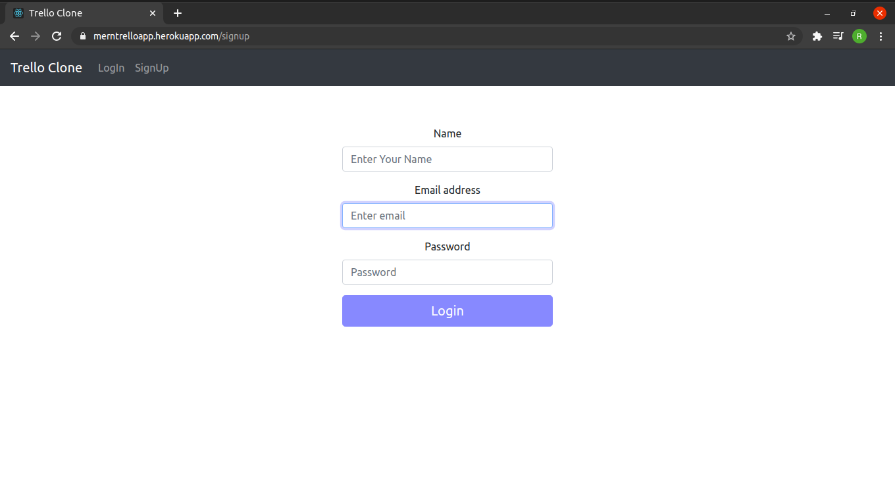

# Trello Clone Application Using MERN 
Basic Trello clone using the MERN stack.

### Views on the Frontend
- /login
- /signup
- /dashboard
- /dashboard/:id/board

### Todos

- [x] Login/Signup
- [x] Authentication using JWT token at application
- [x] Create boards
- [x] Add members to board
- [x] Create and Edit tasks in board
- [x] Moving Tasks
- [x] Add Members to board
- [ ] Remove Members from Task and Board
- [ ] Edit User Details

### Important Requirements

- [x] Boards should only be visible to members if they are included in the board.
- [x] Members can be added by any pre-existing member of the board.
- [x] Task can be moved to different stages by any member of the board.

### Credentials for testing

| Name          | Email            |  Password
| ------------- | ---------------- |---------------|
| Apple         | Apple@gmail.com  |Apple@1234     |
| Banana        | Banana@gmail.com |Banana@1234    |
| Cat           | Cat@gmail.com    |Cat@1234       |
| Dog           | Dog@gmail.com    |Dog@1234       |
| Elephant      | Elephant@gmail.com    |Elephant@1234       |
| Ford          | Ford@gmail.com   |Ford@1234       |
| Greendeck     | Greendeck@gmail.com   |Greendeck@1234       |

### Screenshots

